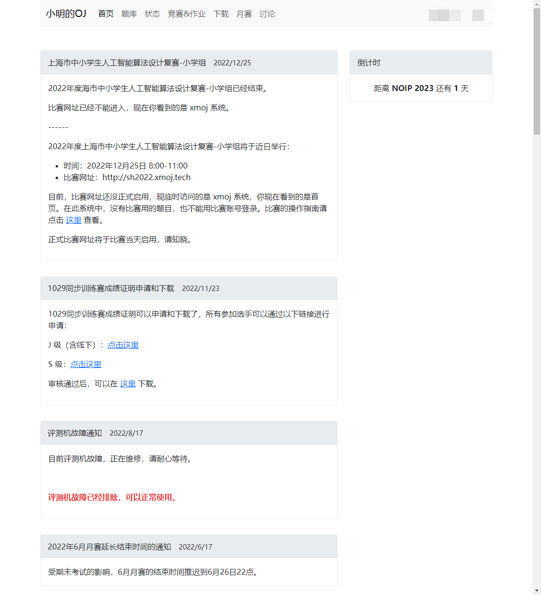
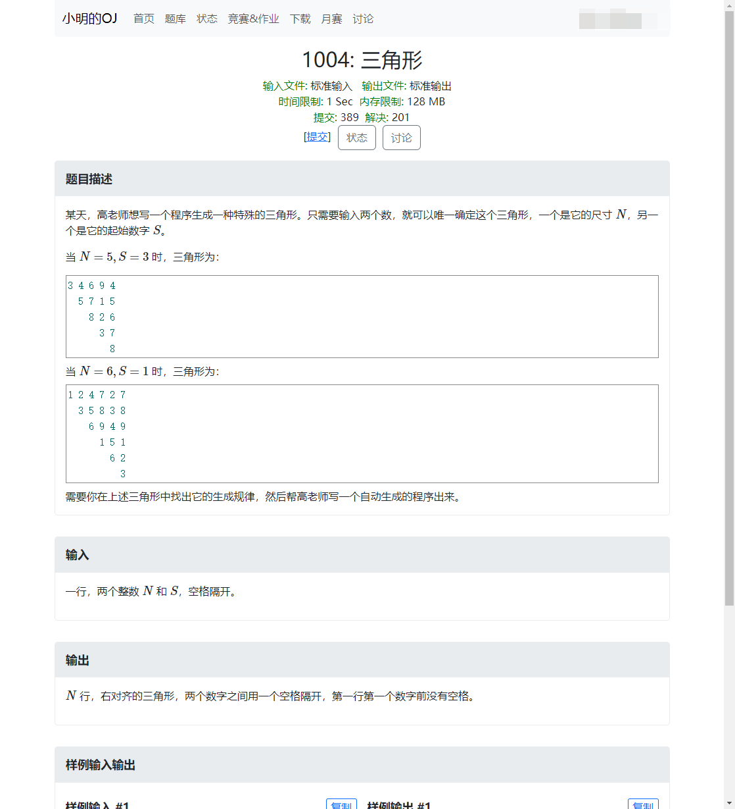

[点击此处访问官网查看更多内容](https://web.xmoj-bbs.tech)

原项目: https://github.com/langningchen/XMOJ-Script

### 帮助文档
地址：https://docs.xmoj-bbs.tech
仓库：https://github.com/XMOJ-Script-dev/docs

### 介绍

`xmoj-script` 是一个功能强大的浏览器扩展，旨在提升用户在小明的OJ（某虚拟在线竞赛平台）上的使用体验。
该脚本通过添加多种实用功能和界面优化，使用户能够更高效地参与竞赛、管理代码和享受更好的界面交互。

- **比赛ACM排名与下载功能**：允许用户查看比赛的ACM排名，并提供下载选项，方便离线查阅。
- **讨论区**：我们自行搭建了一个讨论服务，你可以在里面发表你的声音。
- **短消息**：我们自行搭建了一个短消息服务，你可以在这里和你最好的伙伴交流。
- **查看更多标程**：展示更多的标准程序代码，帮助用户更好地理解题目要求和正确解法。
- **获取测试点数据**：允许用户获取的测试点数据，加快你调试的速度。
- **自动刷新比赛列表与排名**：使比赛列表和排名页面自动定时刷新，获取最新信息。
- **界面时间自动倒计时**：在比赛列表等界面上自动显示剩余时间倒计时，方便用户了解时间情况。
- **回放视频下载功能**：为回放视频添加下载选项，方便用户离线观看回放。
- **自动提交已AC题目**：自动将已通过的题目再次提交，提高题目的通过率。
- **自动选择O2优化**：在代码提交界面自动选择O2优化选项，提高代码效率。
- **界面美化**：改善界面外观，提供更好的用户体验。
    - 使用新版的Bootstrap样式库：更新界面样式，使之更现代。
    - 重新排版：对界面进行重新排版，提高可读性。
    - 增加彩色文字：为界面增加彩色文字元素，增添视觉吸引力。
    - 状态界面添加单位：为状态界面的内存和耗时添加单位，方便理解。
    - 暗色模式：引入暗色模式，减少眼部疲劳。
    - 增加动画：为界面元素增加动画效果，提升交互体验。
    - 对错符号替换：将题目前的对错符号替换为勾和叉，更直观。
    - 去除多余提示：消除界面上多余反复的提示信息。
    - 中文翻译：统一使用中文，翻译部分英文内容，提高可理解性。
    - 替换链接为按钮：将方括号包装的链接替换为按钮，提升操作便捷性。
    - 移除无用功能：去除无法使用的功能，精简界面。
    - 关键词替换：将特定关键词替换为相应内容，增强可读性。
- **自动跳转到登录界面**：在需要登录的页面自动跳转到登录界面，提高操作便捷性。
- **自动保存用户名与密码**：自动保存登录信息，免去每次手动输入的步骤。
- **复制测试样例**：在题目界面复制测试样例内容，方便粘贴到本地编辑器。
- **自动刷新状态页面结果**：使状态页面中的结果自动刷新，便于实时查看变化。
- **复制题目或题解内容**：允许用户复制题目或题解的内容，方便保存和分享。
- **一键打开所有题目**：在比赛题目界面一键打开所有题目，提高操作效率。
- **代码检查功能**：在提交代码前对代码进行检查，以确保代码质量。
    - 是否使用了文件输入输出：检查是否正确使用了文件输入输出功能。
    - 是否有编译错误：检查是否存在编译错误，避免提交无效代码。
- **修复登录后跳转失败**：解决登录后跳转问题，确保用户能够顺利进入下一步操作。
- **下载页面增加内容**：在下载页面增加更多内容，提供更多资源下载。
- **比较代码**：允许用户比较不同版本的代码，方便进行代码对比与分析。
- **学术模式**：开启学术模式，体验极致的学习环境！（此功能部分开发中）

更多图片可在[官网](https://www.xmoj-bbs.tech)上查看

通过小明的OJ增强脚本，您将能够更便捷地参与竞赛，提高AC率，管理代码，优化学习体验，同时享受美化界面带来的愉悦感受。
无论是竞技还是学习，这个脚本都将成为您在小明的OJ平台上的得力助手。
无论您是新手还是经验丰富的竞赛选手，小明的OJ都将为您的比赛体验带来前所未有的便利和效率。
立即安装并体验吧！

### 安装
请参考 [官网介绍](https://www.xmoj-bbs.tech) 。
如果您无法打开该网站，请前往[这里](https://scriptcat.org/zh-CN/script-show-page/1500/)安装。

### 贡献
您想为我们的脚本添砖加瓦吗？快加入我们，为小明的OJ用户创造更美好的环境！（具体要求参见Code Of Conduct）

小明的OJ增强脚本开发期待以您的邂逅！

### 赞助我们
你想贡献出你收入的很小一部分来支持我们的开发吗？欢迎在open collective上支持我们！

链接戳[这里](https://opencollective.com/xmoj-script-dev)。

> [!IMPORTANT]
> 请注意, 外部开发者应向`extern-contrib`提交 pull requests。

## Contributors

<!-- ALL-CONTRIBUTORS-LIST:START - Do not remove or modify this section -->
<!-- prettier-ignore-start -->
<!-- markdownlint-disable -->
<table>
  <tbody>
    <tr>
      <td align="center" valign="top" width="14.28%"><a href="https://github.com/boomzero"> <b>Zhu Chenrui</b></a> <a href="#bug-boomzero" title="Bug reports">🐛</a> <a href="#design-boomzero" title="Design">🎨</a> <a href="#maintenance-boomzero" title="Maintenance">🚧</a> <a href="#code-boomzero" title="Code">💻</a></td>
      <td align="center" valign="top" width="14.28%"><a href="https://github.com/PythonSmall-Q"> <b>Shan Wenxiao</b></a> <a href="#maintenance-PythonSmall-Q" title="Maintenance">🚧</a> <a href="#design-PythonSmall-Q" title="Design">🎨</a> <a href="#bug-PythonSmall-Q" title="Bug reports">🐛</a> <a href="#code-PythonSmall-Q" title="Code">💻</a></td>
      <td align="center" valign="top" width="14.28%"><a href="https://github.com/langningchen"> <b>Langning Chen</b></a> <a href="#design-langningchen" title="Design">🎨</a></td>
    </tr>
  </tbody>
</table>

<!-- markdownlint-restore -->
<!-- prettier-ignore-end -->

<!-- ALL-CONTRIBUTORS-LIST:END -->

